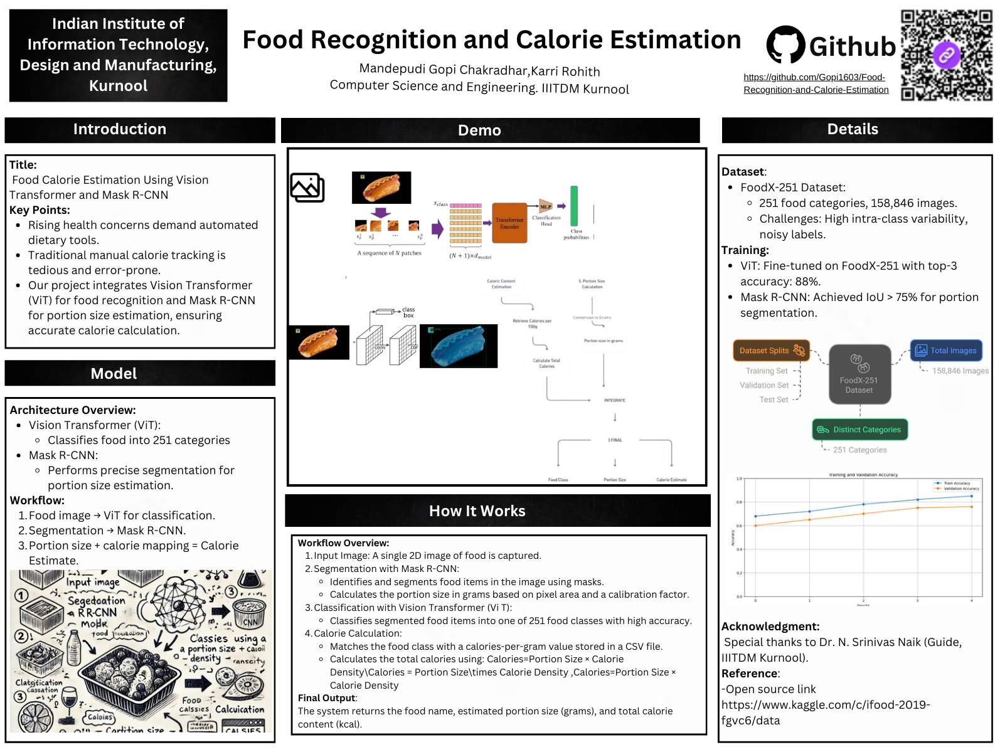
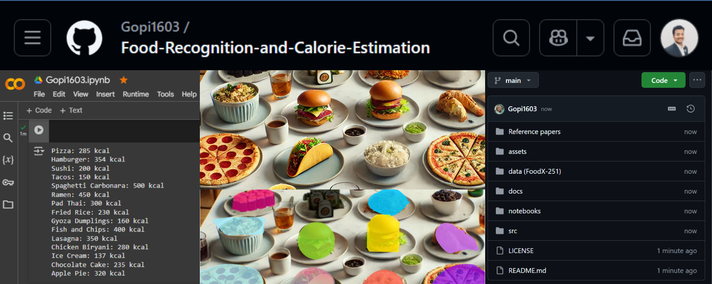
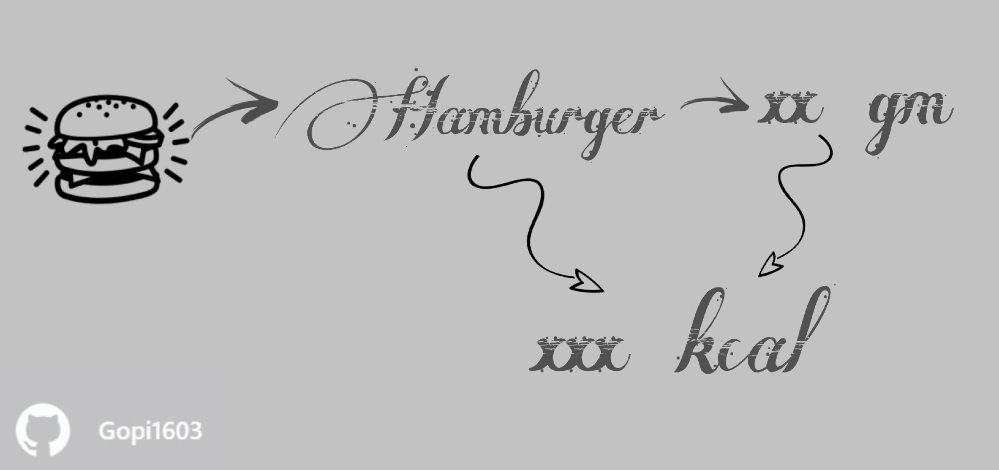
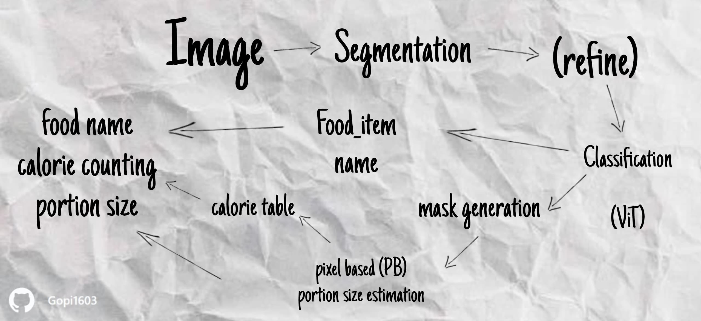

# Food Recognition and Calorie Estimation

**Team Members**: M. Gopi Chakradhar, K. Rohith  
**Guide**: Dr. N. Srinivas Naik, IIITDM Kurnool  


## About the Project
This project integrates Vision Transformer (ViT) and Mask R-CNN to provide an automated solution for food recognition and calorie estimation. By leveraging cutting-edge deep learning techniques, the system identifies food items, calculates portion sizes, and estimates caloric content from a single image.  


## Key Features
- **Accurate classification** of 251 food categories using Vision Transformer.
- **Precise segmentation** of food items with Mask R-CNN for portion size estimation.
- **Automated calorie calculation** based on standardized caloric density values.

## Target Users
Anyone who wants to track their calorie intake effortlessly.

## Dataset
We used the FoodX-251 dataset, consisting of:
- **Training Set**: 120,216 images.
- **Validation Set**: 12,170 images.
- **Test Set**: 28,399 images.

The dataset features a wide variety of food categories, but it poses challenges like noisy labels and high intra-class variability.  
**[Access the dataset here.](data%20(FoodX-251)/Dataset_images_link.txt)**


## System Design  
  
**Workflow Overview**:  


## Technologies Used
- **Deep Learning**: PyTorch, Vision Transformer, Mask R-CNN.
- **Data Handling**: Python, NumPy, Pandas.
- **Visualization**: Matplotlib, Seaborn.
- **Deployment**: Jupyter Notebooks.

## Experimental Results
- **Food Classification Accuracy**: Achieved 88% Top-3 accuracy on FoodX-251.
- **Calorie Estimation Accuracy**: Low percentage error, with minor variations for larger portions.
- **Portion Size Categorization**: Automated segmentation provided IoU > 75% for most categories.


## Core Codebase 
### /Food-Recognition-Calorie-Estimation
```plaintext
├── /notebooks
│   ├── MAIN.ipynb
│   ├── foodx-251-preprocessing.ipynb
│   ├── PART1.ipynb
│   ├── PART2.ipynb
│   ├── Mask_R_CNN_for_Portion_Estimation.ipynb
│   ├── Implementation_and_Inference.ipynb
│   └── Model_Architecture_for_Food_Recognition.ipynb
├── /src
│   ├── classes_names.txt
│   ├── train_info_clean.csv
│   ├── val_info.csv
│   ├── food_estimates_by_gc.csv
│   └── train_info_dirty.csv
├── /data (FoodX-251)
│   ├── Dataset_images_link.txt
│   └── dataset_organization.ipynb
```

### Reports and References:
- **[Project Report](docs/Food%20Calorie%20Estimation%20Using%20ViT%20and%20Mask%20R-CNN.pdf)**: Food Calorie Estimation Using ViT and Mask R-CNN.
- **Literature Review**:- **[Reference Papers](https://github.com/Gopi1603/Food-Recognition-and-Calorie-Estimation/tree/813dd1d6f4e25f48b7e215e95513fa2a092f9c33/Reference%20papers)**


## Similar Products

| App Name        | Pros                                  | Cons                              |
|-----------------|---------------------------------------|-----------------------------------|
| Lose It!        | Tracks weight loss goals.            | No image-based calorie prediction.|
| Calorie Mama    | Classifies food automatically.       | Requires manual weight input.    |
| MyFitnessPal    | Provides detailed nutrition breakdown.| Does not support food recognition from images.|


## Plagiarism Check

For transparency and academic integrity, we have checked the project's report for plagiarism using industry-standard tools.  
You can view the plagiarism report generated by iThenticate here:  
**[iThenticate Plagiarism Report](docs/ithenticate%20(Plagarism).pdf)**

Alternatively, the Turnitin plagiarism check can be accessed here:  
**[Turnitin Plagiarism Report](docs/Turnitin%20(Plagiarism).pdf)**


## For Contributions
For contributions, issues, or pull requests, feel free to reach out or submit to this repository!

---

<sub><sup>✨ Built with passion and creativity by [Gopi Chakradhar](https://gopi-chakradhar.vercel.app/) ✨</sup></sub>
